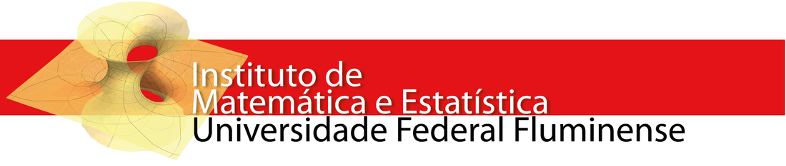

```{r setup, include=FALSE}
knitr::opts_chunk$set(echo = TRUE)
```

   


A propsota dessa modelagem é aplicar conhecimentos e técnicas em modelos lineares obtidos no curso. A modelagem será feita com um banco de dados que contém informações, entre 2010 à 2016, sobre os municípios do estado de São paulo. Após a modelagem, tentaremos criar métricas de redução de óbtos nas estradas do estado. 


A modelagem será feita em duas partes: 

  - Análise de cluster (iremos agrupar os municípios)
  - Regressão linear multipla e tratamento dos resíduos


<br><br>

#### Análise de cluster

No banco de dados, não temos nenhuma variável que seja contextualizada para nosso problema, ou seja, não temos variáveis que remetem a óbtos, acidentes em rodovias, boletins de ocorrência e etc. a ideia da clusterização é nos ajudara criar uma variável proxy que, de alguma forma, nos indique uma medida de acidentes em estradas. 


<br><br>

##### Metodologia utilizada na abordagem

Como esse é um relatório, não explicitaremos a metodologia. Porém, pra mais detalhes, há o trabalho em **PDF**. 


```{r,message = FALSE}
#carregando pacotes necessaios 
require(corrplot)
require(normtest)

set.seed(6)

city_dataset<-read.csv2('city_dataset.csv')
head(city_dataset)
```


Algumas variáveis como os grupos de jovens foram transformadas, além disso, criamos a densidade de veiculos e o pib percapito pra cada município. 


```{r novas variaveis, message=FALSE}
pibpercapita <-city_dataset$pib/city_dataset$populacao
dens_vei     <-city_dataset$veiculos/city_dataset$rodovia
pop1519p     <-city_dataset$pop1519/city_dataset$populacao
pop2024p     <-city_dataset$pop2024/city_dataset$populacao
pop2529p     <-city_dataset$pop2529/city_dataset$populacao


base<-data.frame(cbind(pibpercapita,pop1519p,pop2024p,pop2529p,city_dataset$pjovem,city_dataset$pop60p,city_dataset$pmotos,city_dataset$pmat,dens_vei))
```

Depois de incorporar as transformações no bando de dados, podemos fazer a clusterização. Chegamos a uma inferência subjetiva de que teriamos  mais chances de ter um óbto em um acidente de trânsito que envolve-se moto e jovens. Essa é uma informação útil para o agrupamento. 

Usaremos um método não hierárquico , o algoritmo de k-means, para a clusterização. Os métodos de agrupamentos se baseam em distâncias. 

Basicamente, o modeloe de Kmeans consiste em em fazer uma escolha inicial dos k elementos que formam as sementes iniciais. Esta escolha pode ser feita da seguinte forma:

  - Selecionado as k primeiras observações
  - Selecionando k observações aleatorioamente; e
  - Escolhendo k observações de modo que seus valores sejam bastente diferentes.
  
  
Escolhida as sementes iniciais, é calculada a distância de cada elemento em relação às sementes., agrupando o elemento ao grupo que possuir a menor distância e recalculando o centróide do mesmo. O procedimento, naturalmente, é repetido até que todos os elementos facam parte de um dos clusters.


```{r,fig.align='center',message=FALSE}
names(base)[c(5:8)]<-c('pop60p','pjovem','pmotos','pmat')
omega<-cor(base,use = 'complete.obs')

corrplot(omega)

corrplot(omega, method = "color", cl.pos = "b", type = "lower", addgrid.col = "white",
         addCoef.col = "white", tl.col = "black", tl.cex = 0.7, number.cex = 0.7, cl.cex = 0.7)

  base = cbind(base,cidade =city_dataset$cidade,ano = city_dataset$ano)

base<-data.frame(cbind(pibpercapita,pop1519p,pop2024p,pop2529p,city_dataset$pjovem,city_dataset$pop60p, city_dataset$pmotos,city_dataset$pmat,dens_vei))
names(base)[c(5:8)]<-c('pop60p','pjovem','pmotos','pmat')

```


Criando os clusters com a função 


```{r,message=FALSE}
kmeans_out<-kmeans(na.omit(base[,c('pjovem','pmotos')]),centers = 4)
kmeans_out$size
```

Introduzindo os grupos definidos anteriormente no banco de dados:

```{r}
membros <- kmeans_out$cluster
base<-base[rowSums(is.na(base[,c('pjovem','pmotos','pmat')]))==0,]
city_dataset_cluster <- cbind(base,grupos = membros)
head(city_dataset_cluster)
```

A proxy será uma média ponderada entre as variáveis que usamos para a criação dos centróides, ou seja, 

$$k_{proxy} = peso_{motos}pmotos + peso_{jovens}pjovens$$


```{r,message = FALSE, fig.align="center"}
ind_acidente<-rowSums(kmeans_out$centers)
city_dataset_cluster<-cbind(city_dataset_cluster,NA)
names(city_dataset_cluster)[dim(city_dataset_cluster)[2]]<-'ind_acidente'

for(i in 1:10){
  city_dataset_cluster[city_dataset_cluster$membros==i,'ind_acidente']<-ind_acidente[i]
}
plot(city_dataset_cluster$pjovem,city_dataset_cluster$pmotos,xlab="Porporção de jovens", ylab="Proporção de motos")
points(kmeans_out$centers,pch=19,col=2)

```

Agora, de fato, criremos os pesos e a variável proxy ***"proxy_id_acidentes"***.

```{r, message = FALSE}
pesos<-kmeans_out$centers/ind_acidente;pesos
aux = as.data.frame(pesos)

proxy_ind_acidente = rep(0,times = nrow(city_dataset_cluster))
dataset_final <- cbind(city_dataset_cluster,proxy_ind_acidente = proxy_ind_acidente)

for( i in 1:nrow(city_dataset_cluster)){
  if(city_dataset_cluster$grupo[i]  == 1){
    dataset_final$proxy_ind_acidente[i] = aux$pmotos[1]*dataset_final$pmotos[i] + aux$pjovem[1]*dataset_final$pjovem[i]
  }else if(city_dataset_cluster$grupo[i]  == 2){
    dataset_final$proxy_ind_acidente[i] = aux$pmotos[2]*dataset_final$pmotos[i] + aux$pjovem[2]*dataset_final$pjovem[i]
  }else if(city_dataset_cluster$grupo[i]  == 3){
    dataset_final$proxy_ind_acidente[i] = aux$pmotos[3]*dataset_final$pmotos[i] + aux$pjovem[3]*dataset_final$pjovem[i]
  }else{
    dataset_final$proxy_ind_acidente[i] = aux$pmotos[4]*dataset_final$pmotos[i] + aux$pjovem[4]*dataset_final$pjovem[i]
  }  
}

```

